# PA Legal Case Search System

Multi-method legal case retrieval system for 200k+ Pennsylvania legal cases with BM25 baseline and BERT-based semantic search.

## 🎯 Overview

This project implements three retrieval methods for legal case search:

1. **BM25 (Baseline)**: Traditional keyword-based retrieval (~20ms)
2. **Dense Retrieval**: Legal-BERT dual-encoder for semantic search (~1s)
3. **Dense + Reranking**: Two-stage retrieval with cross-encoder reranking (~30s, cached ~10ms)

## 🏗️ System Architecture

```mermaid
flowchart TB
    User[👤 User] --> Frontend[🖥️ React Frontend]
    Frontend --> API[🔌 Flask API]
    API --> Cache{Redis Cache?}
    Cache -->|Hit ⚡| Return
    Cache -->|Miss| Search[🔍 Search Layer]
    Search --> Storage[(💾 Elasticsearch<br/>200k Legal Cases)]
    Storage --> Return[📄 Results]
    Return --> Frontend
```



### Three Retrieval Methods

```mermaid
flowchart LR
    Query[User Query] --> Method{Method?}

    Method -->|BM25| BM25[BM25 Searcher<br/>~20ms]
    Method -->|Dense| Dense[Dense Searcher<br/>~100ms]
    Method -->|Dense+Rerank| Rerank[Reranker<br/>~3s]

    BM25 --> ES1[(ES BM25 Index)]
    Dense --> BERT1[Legal-BERT] --> ES2[(ES Dense Index)]
    Rerank --> BERT2[Legal-BERT] --> ES3[(ES Dense Index)] --> Cross[Cross-Encoder<br/>Rerank Top-200]

    ES1 --> Results
    ES2 --> Results
    Cross --> Results[📊 Ranked Results]
```



## 📁 Project Structure

```
IR/
├── config.py                    # Configuration (ES, models, etc.)
├── requirements.txt             # Python dependencies
├── batch_download.py           # Download data from case.law
│
├── api/                        # API package
│   ├── app.py                 # Flask app setup & entry point
│   └── routes.py              # API routes
│
├── indexing/                   # Indexing scripts
│   ├── bm25_indexer.py        # Create BM25 index
│   └── dense_indexer.py       # Create dense vector index
│
├── models/                     # BERT models
│   ├── dual_encoder.py        # Legal-BERT for embeddings
│   └── cross_encoder.py       # Cross-encoder for reranking
│
├── search/                     # Search implementations
│   ├── bm25_searcher.py       # BM25 search
│   ├── dense_searcher.py      # Dense vector search
│   └── reranker.py            # Two-stage retrieval
│
└── frontend/                   # React frontend
    └── ...
```

## 🚀 Setup

### 1. Install Dependencies

```bash
pip install -r requirements.txt
```

### 2. Configure Elasticsearch

Update `config.py` with your Elasticsearch credentials:
- `ES_HOST`: Your Elasticsearch host
- `ES_PASSWORD`: Your Elasticsearch password

### 3. Create Indices

**Offline Indexing Pipeline:**

```mermaid
flowchart TB
    Raw[📁 Raw Data<br/>ZIP files with JSON] --> Extract[Extract Cases]

    Extract --> Path1[BM25 Path]
    Extract --> Path2[Dense Path]

    Path1 --> Analyze[Text Analysis<br/>lowercase, stemming, stop words]
    Analyze --> BM25Idx[(BM25 Index<br/>pa_law_cases_bm25)]

    Path2 --> Batch[Batch Process<br/>batch_size=8]
    Batch --> Embed[Legal-BERT Encode<br/>→ 768-dim vectors]
    Embed --> DenseIdx[(Dense Index<br/>pa_law_cases_dense<br/>+ KNN index)]
```



#### BM25 Index (Baseline)
```bash
python -m indexing.bm25_indexer
```

#### Dense Vector Index (for semantic search)
```bash
python -m indexing.dense_indexer
```
Note: This will download Legal-BERT model (~400MB) on first run.

### 4. Start API Server

```bash
python -m api.app
```

API will be available at `http://localhost:5000`

### 5. Start Frontend

```bash
cd frontend
npm install
npm run dev
```

Frontend will be available at `http://localhost:5173`

## 🔌 API Endpoints

### Search Cases
```
GET /cases?query=<text>&method=<method>&size=<n>&page=<p>
```

**Parameters:**
- `query` (required): Search query text
- `method` (optional): Retrieval method
  - `bm25`: Traditional BM25 (default)
  - `dense`: Dense vector retrieval (Legal-BERT)
  - `dense_rerank`: Two-stage (dense + cross-encoder)
- `size` (optional): Number of results (default: 10)
- `page` (optional): Page number (default: 1)

**Example:**
```bash
curl "http://localhost:5000/cases?query=contract%20law&method=dense_rerank&size=5"
```

### Get Case Details
```
GET /cases/<doc_id>?index=<bm25|dense>
```

**Example:**
```bash
curl "http://localhost:5000/cases/12121253?index=bm25"
```

### Health Check
```
GET /health
```

## 🔍 Retrieval Methods

### 1. BM25 (Baseline)
- Traditional keyword-based retrieval
- Uses Elasticsearch's BM25 algorithm
- Fast and lightweight (~20ms)
- Best for exact term matching

### 2. Dense Retrieval
- Uses Legal-BERT dual-encoder
- Model: `nlpaueb/legal-bert-base-uncased`
- Semantic similarity via cosine distance on 768-dim vectors
- Better at capturing semantic meaning (~100ms)
- Filters documents with word_count ≥ 100

### 3. Dense + Reranking (Two-stage)
- **Stage 1 (Coarse)**: Dense retrieval gets top-200 candidates
- **Stage 2 (Fine)**: Cross-encoder reranks candidates
- Model: `BAAI/bge-reranker-large` (560M params)
- Best accuracy but slower (~3s first query, ~10ms cached)
- Redis caching for pagination performance

### Performance Comparison

| Method | First Query | Pagination (Cached) |
|--------|-------------|---------------------|
| BM25 | ~20ms | ~20ms |
| Dense | ~100ms | ~100ms |
| Dense+Rerank | ~3s | **~10ms** ⚡ |

## 💾 Data Storage

**Storage Architecture:**


## ⚙️ Configuration

Edit `config.py` to customize:

```python
# Elasticsearch
ES_INDEX_BM25 = "pa_law_cases_bm25"
ES_INDEX_DENSE = "pa_law_cases_dense"

# Models
DUAL_ENCODER_MODEL = "nlpaueb/legal-bert-base-uncased"
CROSS_ENCODER_MODEL = "BAAI/bge-reranker-large"

# Dense vector configuration
DENSE_VECTOR_DIM = 768

# Reranking parameters
TOP_K_RERANK = 200  # Number of candidates to rerank
```

## 🛠️ Tech Stack

**Backend:**
- Flask (API server)
- Elasticsearch 8.x (search engine)
- Redis (caching)
- PyTorch + Transformers (BERT models)

**Frontend:**
- React 18 + TypeScript
- TailwindCSS
- Vite

**Models:**
- Dual-Encoder: Legal-BERT (768-dim)
- Cross-Encoder: BAAI/bge-reranker-large (560M params)

## 📝 Example Queries

Try these queries to test different methods:

```
breach of fiduciary duty by corporate directors
contract formation requirements
negligence standard of care in medical malpractice
```

## ⚠️ Notes

- Elasticsearch instance needs to be set up locally
- Dense indexing takes longer due to BERT encoding:
  - GPU: ~3 hours
  - CPU: ~12 hours
- BM25 indexing: ~3 hours
- Models are cached after first download
- GPU recommended for faster encoding (CPU works too)
- Redis caching dramatically improves pagination performance for Dense+Rerank

## 📊 Data

- **Source**: Pennsylvania legal cases from case.law API
- **Size**: ~200,000 documents

## 📈 Evaluation Pipeline


